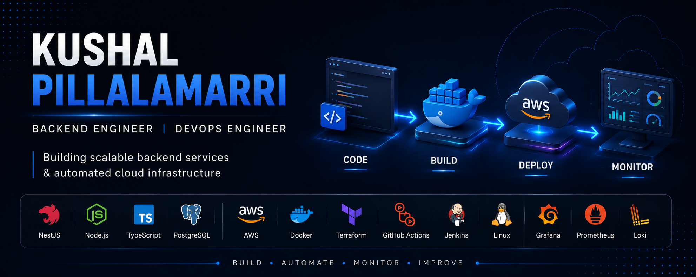

<!-- ========================================================= -->
<!--                  KUSHAL PILLALAMARRI PROFILE               -->
<!-- Save your custom banner as assets/banner.png               -->
<!-- ========================================================= -->

  

### Building reliable backend services, cloud infrastructure & automated deployment pipelines.

---

# 🎯 Focused On

<table>
<tr>
<td align="center" width="20%"><b>⚙️ Backend</b></td>
<td align="center" width="20%"><b>☁️ Cloud</b></td>
<td align="center" width="20%"><b>🚀 DevOps</b></td>
<td align="center" width="20%"><b>🤖 Automation</b></td>
<td align="center" width="20%"><b>📊 Observability</b></td>
</tr>
</table>

---

# 👨‍💻 About Me

Backend & DevOps Engineer focused on building scalable backend services, automating cloud infrastructure, and delivering reliable software.

**Experienced with:** NestJS • REST APIs • AWS • Docker • Terraform • Ansible • Jenkins • GitHub Actions • Grafana • Prometheus • Loki • PostgreSQL

---

# 🛠️ Core Expertise

### Backend

### Cloud & DevOps

### Monitoring & Observability

---

# 📂 Featured Projects

### ⚙️ End-to-End DevOps Pipeline
Provisioned AWS infrastructure using Terraform, containerized applications with Docker, and automated deployments through GitHub Actions and Jenkins.

**Tech Stack:** AWS • Terraform • Docker • Jenkins • GitHub Actions

🔗 **Repository:** `Add your repository link`

---

### ⚡ NestJS REST API

Production-ready REST API built with NestJS featuring authentication, PostgreSQL integration and Dockerized deployment.

**Tech Stack:** NestJS • PostgreSQL • JWT • Docker

🔗 **Repository:** `Add your repository link`

---

### 📊 Observability Stack

Centralized monitoring and logging solution using Grafana, Prometheus, Loki and Node Exporter for infrastructure visibility.

**Tech Stack:** Grafana • Prometheus • Loki • Node Exporter

🔗 **Repository:** `Add your repository link`

---

# 📈 GitHub Analytics

---

# 🎯 Currently Building

- Backend APIs with **NestJS**
- Cloud Infrastructure on **AWS**
- Infrastructure as Code with **Terraform**
- CI/CD Automation
- Monitoring Dashboards
- System Design & Cloud Security

---

# 🌐 Connect With Me

🐙 <a href="https://github.com/kushal-codehub"><b>GitHub</b></a>
&nbsp;&nbsp;&nbsp;&nbsp;&nbsp;&nbsp;
💼 <a href="https://www.linkedin.com/in/kushal-pillalamarri/"><b>LinkedIn</b></a>
&nbsp;&nbsp;&nbsp;&nbsp;&nbsp;&nbsp;
📧 <b>kushalpillalamarri@gmail.com</b>

Open to Backend • DevOps • Cloud Engineering opportunities

---

## ✨ Build. Automate. Monitor. Improve.

*"Turning ideas into reliable software through backend engineering, cloud infrastructure, and automation."*

If you like my work, feel free to connect or explore my repositories.

